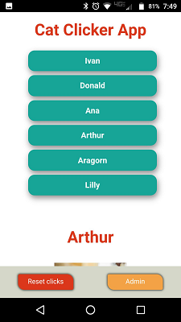
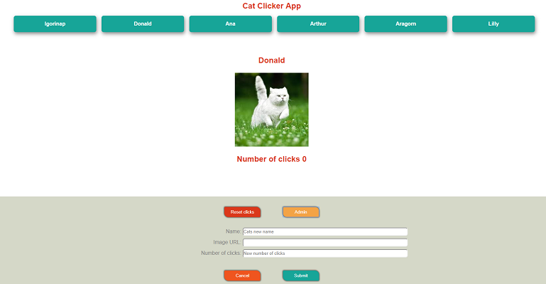

# Cat Clicker MVC Pro 2018

Cat Clicker MVC Pro is an app that have multiple clicable cat images with click counter for each image, stored in local storage. Also, one can reset clicks, change the name, url and number of clicks for each cat using form.

## Table of Contents

* [Link to a game on github Pages](#app-link)
* [App Preview](#mobile-and-desktop-app-preview)
* [App implementation](#implementation)

## App link

https://igor333m.github.io/catclickerMVCpro/

## Mobile and desktop app preview

## Implementation

This is upgraded Cat Clicker project with an admin button that allows the user to change the cats' information. The JavaScript is organized within a MVC (Model, View, Controller) architecture.